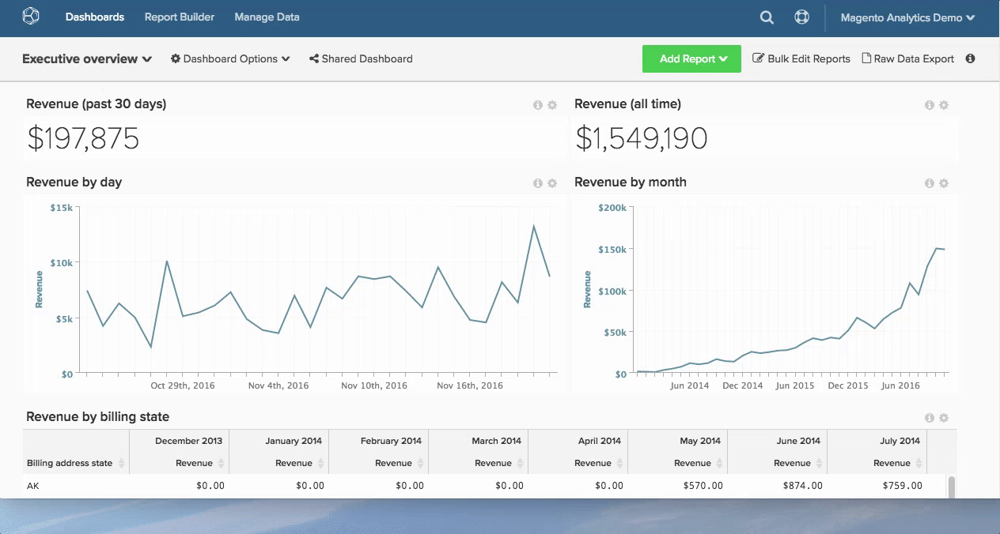

# Usar um relatório

Use relatórios em [!DNL MBI] para ajudá-lo a responder perguntas comerciais - quer você queira apenas ver a receita deste mês em comparação ao ano anterior ou entender os custos de aquisição para obter as últimas informações [!DNL Google AdWords] campanha.

Como se parece exatamente esse caminho da pergunta para a resposta?

Para ajudar você a visualizar esse processo, mapeamos essa rota abaixo. Este tópico vai trazer alguma luz sobre como abordamos uma questão analítica e a logística de backend necessária para obter os dados de que você precisa.

## Começando com a pergunta

Sabemos que você está sempre fazendo perguntas para melhorar seus negócios, desde aumentar a satisfação do cliente até reduzir os custos de suprimento. Vamos nos concentrar em como traduzir suas perguntas em análises que ajudam a guiar as decisões.

Para nosso exemplo, supomos que queiramos responder a seguinte pergunta:

* Com que velocidade meus novos registrantes são convertidos?

## Identificação de uma medida

Com a nossa pergunta em mãos, é hora de identificar uma lista de possíveis análises e medidas para ajudar a responder a pergunta. Para este exemplo, concentre-se na seguinte métrica:

* Tempo médio desde o registro até a data da primeira compra por uso.

Isso revelará o tempo médio decorrido entre a data de registro e a primeira data de compra do usuário e fornecerá uma ideia sobre como os usuários se comportam nessa etapa final no funil de conversão.

## Encontrar os dados

Compreender o que medir só nos faz parte do caminho. Para avaliar o tempo médio do registro para a primeira data de compra por usuário, precisamos identificar todos os pontos de dados que compõem nossa medida.

Analise nossa medida em seus componentes principais: precisamos saber a contagem, ou número, de pessoas que se registraram; a contagem de pessoas que fizeram uma compra; e o tempo decorrido entre esses dois eventos.

Em um nível superior, precisamos saber onde encontrar esses dados no banco de dados, especificamente:

* A tabela que registra uma linha de dados sempre que alguém registra
* A tabela que registra uma linha de dados sempre que alguém faz uma compra
* A coluna que pode ser usada para unir ou fazer referência à `purchase` à tabela `customer` tabela - permitirá saber quem fez uma compra

Em um nível mais granular, é necessário identificar os campos de dados exatos que serão usados para essa análise:

* A tabela e coluna de dados que contêm a data de registro de um cliente: por exemplo `user.created\_at`
* A tabela e a coluna de dados que contêm a data de compra: por exemplo `order.created\_at`

## Criação de colunas de dados para análise

Além das colunas de dados nativos descritas acima, também precisaremos de um conjunto de campos de dados calculados para permitir essa análise, incluindo:

* `Customer's first purchase date` que retorna um `MIN(order.created_at`)

Isso será usado para criar:

* `Time between a customer's registration date and first purchase date`, que retorna o tempo de um usuário específico decorrido entre o registro e a primeira data de compra. Essa será a base para nossa métrica posteriormente.

Ambos os campos precisam ser criados no nível do usuário (por exemplo, no `user` tabela), para que a análise média possa ser normalizada pelos usuários (em outras palavras, o denominador nesse cálculo médio será a contagem de usuários).

É aqui que [!DNL MBI] etapas em! Você pode aproveitar seu [!DNL MBI] data warehouse para criar as colunas acima. Basta entrar em contato com a equipe de analistas e fornecer a definição específica de suas novas colunas e criaremos elas. Você também pode aproveitar nosso [Editor de colunas](../../data-analyst/data-warehouse-mgr/creating-calculated-columns.md).

É uma prática recomendada evitar a criação desses campos de dados calculados no banco de dados diretamente, pois isso causa uma carga desnecessária para os servidores de produção.

## Criação da métrica

Agora que temos os campos de dados necessários para nossa análise, é hora de encontrar ou criar a métrica relevante para construir nossa análise.

Aqui sabemos que, matematicamente, queremos executar o seguinte cálculo:

_[SOMA de `Time between a customer's registration date and first purchase date`] / [Número total de clientes que se registraram e compraram]_

E queremos ver esse cálculo traçado ao longo do tempo, ou as tendências, de acordo com a data de registro de um cliente. E aqui está como [criar esta métrica](../../data-user/reports/ess-manage-data-metrics.md) em [!DNL MBI]:

1. Ir para **[!UICONTROL Data]** e selecione o `Metrics` guia .
1. Clique em **[!UICONTROL Add New Metric]** e selecione o `user` tabela (onde criamos as dimensões acima).
1. Na lista suspensa , selecione `Average` no`Time between a customer's registration date and first purchase date` na coluna `user` tabela ordenada pela `Customer's registration date`  coluna.
1. Adicione filtros ou conjuntos de filtros relevantes.

Essa métrica está pronta.

## Criação do relatório

Com a nova métrica configurada, podemos usá-la para relatar o tempo médio entre o registro e a data da primeira compra por data de registro.

Basta acessar qualquer painel e [criar um novo relatório](../../data-user/reports/ess-manage-data-metrics.md) usando a métrica criada acima.

### `Visual Report Builder` {#visualrb}

[O `Visual Report Builder`](../../data-user/reports/ess-rpt-build-visual.md) é a maneira mais fácil de visualizar seus dados. Se você não está familiarizado com o SQL ou deseja criar um relatório rapidamente, o Visual Report Builder é a melhor opção. Com apenas alguns cliques, você pode adicionar métricas, segmentar seus dados e criar relatórios para a organização. Esta opção é perfeita tanto para os iniciantes como para os peritos, uma vez que não requer qualquer especialização técnica.

|  |  |
|--- |--- |
| **Isso é perfeito para...** | **Isso não é tão bom para...** |
| - Todos os níveis de análise/experiência técnica - Criar relatórios rapidamente - Criação de análises para compartilhar com outros usuários | - Análises que exigem funções específicas de SQL - Teste de novas colunas - as colunas calculadas dependem dos ciclos de atualização da população de dados inicial, enquanto as criadas usando o SQL não |

{style=&quot;table-layout:auto&quot;}

### Descrições e imagens do relatório

#### Adicionar descrições aos relatórios

Ao criar relatórios que serão compartilhados com outros membros de sua equipe, recomendamos adicionar descrições que permitirão que outros usuários entendam melhor sua análise.

1. Clique em **[!UICONTROL i]** na parte superior de qualquer relatório.
1. Insira uma descrição na caixa de palavras.
1. Clique em **[!UICONTROL Save Description]**.

Vejamos:

#### Exportação de relatórios como imagens

Precisa incluir um relatório em uma apresentação ou documento? Qualquer relatório pode ser salvo como uma imagem (no formato PNG, PDF ou SVG) usando o `Report Options` , localizado no canto superior direito de cada relatório.

1. Clique no ícone de engrenagem no canto superior direito de qualquer relatório.
1. Na lista suspensa , selecione `Enlarge`.
1. Quando o relatório for ampliado, clique em **[!UICONTROL Download]** no canto superior direito do relatório.
1. Selecione o formato de imagem preferencial na lista suspensa. O download começará imediatamente.

Dê uma olhada:

