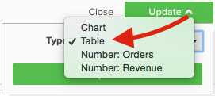
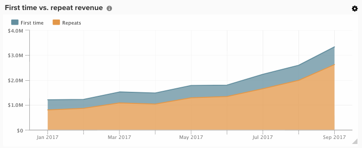
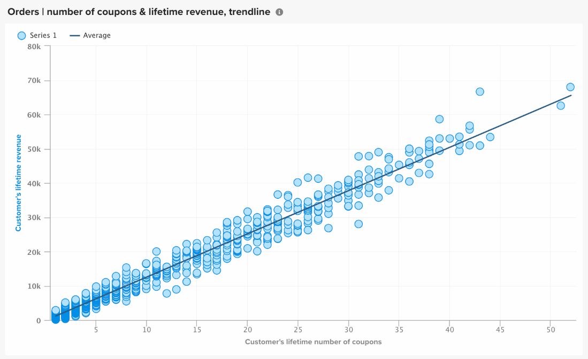

# Opções de visualização

Selecionar a visualização correta para um determinado conjunto de dados é uma parte essencial do processo analítico. Todo conjunto de dados tem uma história para contar, mas o efeito dessa história é enfatizado pelo seu impacto visual e legibilidade.

O [!DNL MBI] `Visual Report Builder` O oferece 12 opções de visualização distintas, cada uma com suas próprias vantagens e casos de uso. Este artigo discute as várias opções de visualização em [!DNL MBI], incluindo as configurações de relatório necessárias, quando aplicável, bem como um exemplo de caso de uso. As seguintes visualizações estão disponíveis na MBI:

* `Scalar`
* `Table`
* `Line`
* `Bar`
* `Stacked Bar`
* `Column`
* `Stacked Column`
* `Pie`
* `Area`
* `Funnel`
* `Scatter plot`
* `Bubble`
* `Heatmap`

## `Scalar`

`Scalar` os relatórios são exibidos como um único valor numérico. Na maioria das vezes, isso é usado para mostrar o valor &quot;sempre&quot; de uma métrica principal como receita ou pedidos, ou para comparar a receita acumulada com o orçamento com dois relatórios escalares separados. No exemplo abaixo, isso simplesmente mostra o número total de pedidos para o intervalo de relatório fornecido:

Para salvar um relatório como um escalar, defina os filtros e as configurações de tempo e clique em **[!UICONTROL Save]** ou **[!UICONTROL Update]** no canto superior direito do relatório. Em `Type` na lista suspensa, escolha o Número: Nome da métrica para salvar o relatório como o valor mostrado na barra lateral esquerda.

**Requisitos**:

* `Time interval`: `None`
* `Group by`: `None`
* Somente uma métrica

## `Table`

Como o nome sugere, `table` os relatórios são excelentes para exibir detalhes da tabela. Quando há necessidade de exibir um grande número de grupos por valores ou métricas em um único relatório, uma tabela é geralmente a melhor maneira de prosseguir. Como exemplo, abaixo está uma tabela de &quot;Detalhes do cliente&quot;, mostrando pedidos e receita agrupados por email do cliente:

Semelhante aos relatórios escalares, é possível salvar um relatório como uma tabela clicando em **[!UICONTROL Save]** ou **[!UICONTROL Update]** no construtor de relatórios, em seguida, selecione a opção Tabela no `Type` lista suspensa.

**Requisitos:**

* Embora não haja requisitos de configuração de relatório, é importante observar que as tabelas estão limitadas a 3500 linhas. Se o conjunto de dados incluir mais de 3500 linhas, será necessário filtrar os resultados para restringir o escopo ou exportar os resultados para `.csv` ou `Excel` para ver o conjunto de dados completo.

## `Line`

`Line` os gráficos são a escolha perfeita para comparar o desempenho de coortes de métrica semelhantes. Por exemplo, analisar a receita de duas regiões durante o mesmo período ou comparar o crescimento homólogo das ordens cumpridas, conforme mostrado abaixo:

Cada métrica e fórmula adicionada ao relatório é representada por sua própria linha. Ao comparar métricas com unidades e escalas semelhantes, não se esqueça de desmarcar a caixa de seleção de `Multiple Y-Axes` para exibir todas as métricas na mesma escala.

Para salvar um relatório como um gráfico de linha, ajuste o relatório `Type` para `Chart`e selecione a visualização apropriada no construtor de relatórios, conforme mostrado abaixo:

**Requisitos:**

* Nenhum

## `Bar`

`Bar` os gráficos exibem seus dados como uma série de barras horizontais e são melhores para mostrar o desempenho geral de um número limitado de métricas ou agrupar por valores. Por exemplo, um gráfico de barras pode ser usado para comparar a receita por loja:

Cada combinação de métrica, grupo por e intervalo de tempo distinta é exibida como sua própria barra. Se você tiver duas métricas com uma `group by`, contendo três elementos distintos `group by` , seu relatório mostrará seis barras separadas.

Para salvar um relatório como um gráfico de barras, ajuste o relatório `Type` para `Chart` e selecione o `Bar` conforme mostrado abaixo:

**Requisitos:**

* Nenhum

## `Stacked Bar`

`Stacked bar` os gráficos são semelhantes aos seus limites do gráfico de barras, com a capacidade adicional de exibir o detalhamento proporcional de cada barra. Na maioria das vezes, gráficos de barras empilhadas são configurados com duas ou mais métricas e um único grupo por, de modo que cada barra represente um grupo exclusivo por valor que é dividido entre seus componentes de métrica.

Como exemplo, o relatório abaixo tem duas métricas de receita idênticas: um filtrado para pedidos pela primeira vez e o outro filtrado para pedidos repetidos. Após agrupar por armazenamento, é possível ver a contribuição total da receita para cada loja (representada pela largura total da barra), bem como a primeira vez vs. detalhamento repetido da receita para cada loja:

Certifique-se de que o `Multiple Y-Axes` está desmarcada ao configurar um relatório como o acima.

Para salvar um relatório como um gráfico de barras empilhadas, ajuste o relatório `Type` para `Chart` e selecione a opção barra empilhada no construtor de relatórios:

**Requisitos:**

* Nenhum

## `Column`

`Column` os gráficos representam cada ponto de dados como uma coluna vertical e, em geral, são melhores para exibir dados de tendência de tempo do que a visualização do gráfico de barras horizontal. Como cada métrica única e cada combinação é representada em sua própria série de barras, um relatório de coluna geralmente é melhor para relatórios com três ou menos métricas, ou uma métrica com um único grupo contendo 1 a 3 grupos por valores.

No exemplo abaixo, estamos mostrando duas métricas de receita, uma filtrada pela primeira vez de receita e outra pela repetição de receita, com tendência ao longo do tempo por mês:

Os relatórios de coluna podem ser salvos alterando o relatório `Type` para `Chart`e selecionando a opção de visualização de coluna :

**Requisitos:**

* Nenhum

## `Stacked Column`

`Stacked column` os relatórios são quase idênticos aos gráficos de coluna, exceto que colunas semelhantes são empilhadas umas sobre as outras, de modo que a altura total representa a soma dos valores. Colunas empilhadas são novamente melhor visualizadas com um número limitado de métricas ou compartimentos de grupo.

Usar a mesma configuração de relatório descrita na seção `Column` seção acima, um relatório com duas métricas de receita (filtradas pela primeira vez e repetidas) seria semelhante ao relatório abaixo com uma visualização de coluna empilhada:

Mais uma vez, é importante que a variável `Multiple Y-Axes` é desmarcada ao exibir várias métricas com a visualização de coluna empilhada.

Para salvar um relatório como uma coluna empilhada, defina o relatório `Type` para `Chart` e selecione o `stacked column` opção:

**Requisitos:**

* Nenhum

## `Pie`

`Pie` os gráficos são melhores para exibir uma única métrica com um ou mais grupos ou várias métricas sem grupos. Em ambos os casos, o intervalo deve ser definido como nenhum para exibir dados em um gráfico de pizza. No exemplo abaixo, uma única métrica de pedidos é agrupada por nome de loja para mostrar o detalhamento de pedidos por armazenamento:

Para salvar um relatório como gráfico de pizza, defina o relatório `Type` para `Chart` e selecione o `pie` conforme mostrado abaixo:

**Requisitos:**

* `Time interval`: `None`
* Uma das seguintes opções:
   * `Single metric with one or more group bys`
   * `Multiple metrics with no group bys`

## `Area`

`Area` os gráficos são quase idênticos aos gráficos de colunas empilhadas, exceto que as colunas são exibidas continuamente. Semelhante às colunas empilhadas, os gráficos de área são mais adequados para visualização com um número limitado de métricas ou compartimentos de grupo.

Tomando o mesmo exemplo da `stacked column` , o relatório abaixo mostra a primeira vez versus a receita repetida com a visualização do gráfico de área:

Para salvar um relatório como um gráfico de área, ajuste a variável `Type` para `Chart` e selecione a opção de área:

**Requisitos:**

* Nenhum

## `Funnel`

`Funnel` os gráficos são perfeitos para visualizar a conversão em uma sequência esperada de eventos. Alguns exemplos incluem analisar a receita potencial em seu funil de vendas de clientes potenciais em caso de venda ou medir a queda em clientes entre seus primeiros e segundos pedidos, segundo e terceiro pedidos e assim por diante. Um exemplo do último é exibido abaixo:

Em um relatório de funil, o valor relativo de uma determinada etapa do funil é refletido pela altura da etapa, e a ordem em que as etapas são exibidas é determinada pela configuração do relatório. Há duas maneiras de configurar um relatório de funil:

* `Single metric with one group by`: - Ordem das etapas determinada pela configuração &quot;Mostrar parte superior/inferior&quot; do grupo por. Por padrão, as etapas de funil são exibidas em ordem do maior para o menor valor, mas também é possível classificá-las alfabeticamente pelo grupo por nome.

* `Multiple metrics with no group by`: - Ordem das etapas determinadas pela ordem em que as métricas são adicionadas ao relatório.

Para salvar um relatório como um gráfico de funil, ajuste o relatório `Type` para `Chart` e selecione a visualização apropriada no construtor de relatórios.

**Requisitos:**

* `Time interval`: `None`
* Uma das seguintes opções:
   * `Single metric with one group by`
   * `Multiple metrics with no group by`

## `Scatter plot`

A `scatter plot` O é usado para examinar a relação de uma métrica com duas variáveis diferentes, para que você possa identificar facilmente correlações e discrepâncias. Esse tipo de visualização é melhor usado somente com dimensões numéricas - tente com a métrica Pedidos e o `Customer's lifetime number of coupons` e `Customer's lifetime revenue` dimensões para ver como o uso do cupom está relacionado à receita. Você pode escolher entre um gráfico de dispersão com e sem uma linha de tendência:

**Requisitos:**

Opção 1:

* Dois `metrics`
* One `group by`
* `Time interval`: `None`

Opção 2:

* Dois `metrics`
* Não `group by`
* Definir `time interval`

## `Bubble` gráfico

A `bubble` o gráfico pode exibir até quatro dimensões de dados em que a variável `X` e `Y` eixos especificam o local das bolhas, a variável `Z` eixo é o tamanho das bolhas e, ao incluir dois grupos, é possível adicionar cor às bolhas. Esse tipo de visualização é melhor usado quando você deseja plotar várias dimensões de dados em um único gráfico.

Por exemplo, o gráfico a seguir mostra o número de clientes (tamanho da bolha) agrupados por uma fonte de aquisição específica (cor da bolha) e o estado (várias bolhas em cores específicas), representados pela receita total e pela média das ordens de vida útil.

O gráfico a seguir mostra o número de clientes (tamanho da bolha) agrupados por fonte de aquisição (cor da bolha) e estado (várias bolhas em cores específicas), representados pelo valor médio da vida útil e pela receita total.

**Requisitos para o gráfico de bolhas de uma única série:**

Opção 1

* Três `metrics`
* One `group by`
* `Time interval`: `None`

Opção 2

* Três `metrics`
* Não `group by`
* Definir `time interval`

**Requisitos para o gráfico de bolhas de várias séries:**

* Três `metrics`
* Dois `group by`
* `Time interval`: `None`

## `Heatmap`

Use `heatmaps` para visualizar hot spots em seus dados. Por exemplo, um mapa de calor pode indicar onde você obtém um volume maior rotineiramente. A visualização desses dados pode ajudá-lo a ajustar os níveis de inventário para garantir que você atenda à demanda durante as janelas de pico.

O mapa de calor a seguir mostra pedidos por dia da semana por hora do dia, ao longo de várias semanas.

<!--{: width="650"}-->

**Requisitos:**

Opção 1

* One `metric`
* Dois `group by`
* `Time interval`: `None`

Opção 2

* One `metric`
* One `group by`
* Definir `time interval`
