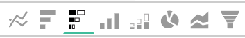

# Opções de visualização

Selecionar a visualização correta para um determinado conjunto de dados é uma parte essencial do processo analítico. Cada conjunto de dados tem uma história para contar, mas o efeito dessa história é enfatizado por seu impacto visual e legibilidade.

O [!DNL Commerce Intelligence] [!DNL Visual Report Builder] oferece 12 opções de visualização distintas, cada uma com suas próprias vantagens e casos de uso. Este tópico discute as várias opções de visualização no [!DNL Commerce Intelligence], incluindo as configurações de relatório necessárias quando aplicável, e um exemplo de caso de uso. As seguintes visualizações estão disponíveis em [!DNL Commerce Intelligence]:

* `Scalar`
* `Table`
* `Line`
* `Bar`
* `Stacked Bar`
* `Column`
* `Stacked Column`
* `Pie`
* `Area`
* `Funnel`
* `Scatter plot`
* `Bubble`
* `Heatmap`

## `Scalar`

`Scalar` relatórios são exibidos como um valor único e numérico. Na maioria das vezes, isso é usado para mostrar o valor &quot;sempre&quot; de uma métrica principal, como receita ou pedidos, ou para comparar receita para data versus orçamento com dois relatórios escalares separados. No exemplo abaixo, isso mostra apenas o número total de pedidos para um determinado intervalo de geração de relatórios:

Para salvar um relatório como escalar, defina as configurações de filtros e tempo e clique em **[!UICONTROL Save]** ou **[!UICONTROL Update]** na seção superior direita do relatório. Na lista suspensa `Type`, escolha Número: Nome da métrica para salvar o relatório como o valor mostrado na barra lateral esquerda.

**Requisitos**:

* `Time interval`: `None`
* `Group by`: `None`
* Somente uma métrica

## `Table`

Como o nome sugere, os relatórios `table` são ótimos para exibir detalhes tabulares. Quando é necessário exibir muitos grupos por valores ou métricas em um único relatório, uma tabela geralmente é a melhor maneira de seguir em frente. Como exemplo, abaixo há uma tabela de &quot;Detalhes do cliente&quot;, mostrando pedidos e receita agrupados por email do cliente:

Semelhante aos relatórios escalares, você pode salvar um relatório como uma tabela clicando em **[!UICONTROL Save]** ou **[!UICONTROL Update]** no Report Builder e selecionando a opção Tabela na lista suspensa `Type`.

**Requisitos:**

* Embora não haja requisitos de configuração de relatório, é importante observar que as tabelas são limitadas a 3.500 linhas. Se seu conjunto de dados incluir mais de 3.500 linhas, você precisará filtrar os resultados para restringir o escopo ou exportar os resultados para `.csv` ou `Excel` para ver o conjunto de dados completo.

## `Line`

`Line` gráficos são a escolha perfeita para comparar o desempenho de coortes de métricas semelhantes. Por exemplo, analisar a receita de duas regiões durante o mesmo período de tempo ou comparar o crescimento ano a ano em ordens atendidas, conforme mostrado abaixo:

Cada métrica e fórmula adicionada ao relatório é representada por sua própria linha. Ao comparar métricas com unidades e escalas semelhantes, não se esqueça de marcar a caixa de seleção `Multiple Y-Axes` para exibir todas as métricas na mesma escala.

Para salvar um relatório como um gráfico de linhas, ajuste o relatório `Type` como `Chart` e selecione a visualização apropriada no construtor de relatórios, conforme mostrado abaixo:

**Requisitos:**

* Nenhum

## `Bar`

Os gráficos do `Bar` exibem seus dados como uma série de barras horizontais e são melhores para mostrar o desempenho geral de um número limitado de métricas ou agrupar por valores. Por exemplo, um gráfico de barras pode ser usado para comparar a receita por loja:

Cada métrica distinta, agrupar por e combinação de intervalo de tempo é exibida como sua própria barra. Se você tiver duas métricas com uma `group by`, contendo três valores `group by` distintos, seu relatório mostrará seis barras separadas.

Para salvar um relatório como um gráfico de barras, ajuste o relatório `Type` para `Chart` e selecione a opção `Bar` conforme mostrado abaixo:

**Requisitos:**

* Nenhum

## `Stacked Bar`

`Stacked bar` gráficos são semelhantes aos seus irmãos de gráfico de barras, com a capacidade adicional de exibir o detalhamento proporcional de cada barra. Na maioria das vezes, os gráficos de barras empilhadas são configurados com duas ou mais métricas e um único grupo por, de modo que cada barra representa um grupo exclusivo por valor que é dividido entre seus componentes de métrica.

Por exemplo, o relatório abaixo tem duas métricas de receita idênticas, uma filtrada para pedidos iniciais e a outra filtrada para pedidos repetidos. Após o agrupamento por loja, você pode ver a contribuição da receita total para cada loja (representada pela largura total da barra) e o detalhamento da receita pela primeira vez vs. repetição para cada loja.

Certifique-se de que a caixa `Multiple Y-Axes` esteja desmarcada ao configurar um relatório como o acima.

Para salvar um relatório como um gráfico de barras empilhadas, ajuste o relatório `Type` como `Chart` e selecione a opção de barras empilhadas no Report Builder:

**Requisitos:**

* Nenhum

## `Column`

`Column` gráficos representam cada ponto de dados como uma coluna vertical e são melhores para exibir dados de tendência de tempo do que a visualização de gráfico de barra horizontal. Cada métrica exclusiva e grupo por combinação é representado em sua própria série de barras. Um relatório de coluna é melhor para relatórios com três ou menos métricas, ou uma métrica com um único grupo contendo de 1 a 3 valores agrupar por.

No exemplo abaixo, você vê duas métricas de receita, uma filtrada para receita pela primeira vez e a outra para receita repetida, com tendência ao longo do tempo por mês:

Para salvar relatórios de coluna, altere o relatório `Type` para `Chart` e selecione a opção de visualização de coluna:

**Requisitos:**

* Nenhum

## `Stacked Column`

`Stacked column` relatórios são quase idênticos aos gráficos de coluna, exceto que colunas semelhantes são empilhadas uma sobre a outra de modo que a altura total representa a soma dos valores. As colunas empilhadas são novamente melhor visualizadas com um número limitado de métricas ou grupos.

Usando a mesma configuração de relatório descrita na seção `Column` acima, um relatório com duas métricas de receita (filtrado pela primeira vez e repetido) seria semelhante ao mostrado abaixo com uma visualização de coluna empilhada:

Novamente, é importante que a caixa de seleção `Multiple Y-Axes` seja desmarcada ao exibir várias métricas com a visualização de coluna empilhada.

Para salvar um relatório como uma coluna empilhada, defina o relatório `Type` como `Chart` e selecione a opção `stacked column`:

**Requisitos:**

* Nenhum

## `Pie`

`Pie` gráficos são melhores para exibir uma única métrica com um ou mais agrupamentos, ou várias métricas sem agrupamentos. Em ambos os casos, o intervalo de tempo deve ser definido como nenhum para exibir dados em um gráfico de pizza. No exemplo abaixo, uma única métrica de pedidos é agrupada por nome de armazenamento para mostrar o detalhamento de pedidos por armazenamento:

Para salvar um relatório como um gráfico de pizza, defina o relatório `Type` como `Chart` e selecione a opção `pie` conforme mostrado abaixo:

**Requisitos:**

* `Time interval`: `None`
* Qualquer uma das seguintes opções:
   * `Single metric with one or more group bys`
   * `Multiple metrics with no group bys`

## `Area`

`Area` gráficos são quase idênticos aos gráficos de colunas empilhadas, exceto que as colunas são exibidas continuamente. Semelhante às colunas empilhadas, os gráficos de área são melhor visualizados com um número limitado de agrupamentos ou métricas.

Usando o mesmo exemplo da seção `stacked column`, o relatório abaixo mostra a primeira vez em comparação com a receita repetida com a visualização do gráfico de área:

Para salvar um relatório como um gráfico de área, ajuste o `Type` como `Chart` e selecione a opção de área:

**Requisitos:**

* Nenhum

## `Funnel`

`Funnel` gráficos são perfeitos para visualizar a conversão em uma sequência esperada de eventos. Alguns exemplos incluem analisar a receita potencial em seu funnel de vendas, desde o lead até o negócio fechado, ou medir a queda nos clientes entre seu primeiro e segundo pedidos, segundo e terceiro pedidos e assim por diante. Um exemplo deste último é exibido abaixo:

Em um relatório do funnel, o valor relativo de uma determinada etapa do funnel é refletido pela altura da etapa. A configuração do relatório determina a ordem em que as etapas são exibidas. Há duas maneiras de configurar um relatório do funnel:

* `Single metric with one group by`: - Ordem de etapas determinada pela configuração &quot;Mostrar Superior/Inferior&quot; do grupo por. Por padrão, as etapas do funnel são exibidas em ordem, do maior ao menor valor, mas você também pode classificá-las alfabeticamente pelo nome do grupo.

* `Multiple metrics with no group by`: - Ordem de etapas determinada pela ordem em que as métricas são adicionadas ao relatório.

Para salvar um relatório como um gráfico funnel, ajuste o relatório `Type` para `Chart` e selecione a visualização apropriada no construtor de relatórios.

**Requisitos:**

* `Time interval`: `None`
* Qualquer uma das seguintes opções:
   * `Single metric with one group by`
   * `Multiple metrics with no group by`

## `Scatter plot`

Um `scatter plot` é usado para examinar a relação de uma métrica com duas variáveis diferentes, para que você possa identificar facilmente correlações e valores atípicos. Esse tipo de visualização é melhor usado somente com dimensões numéricas. Experimente com a métrica Pedidos e as dimensões `Customer's lifetime number of coupons` e `Customer's lifetime revenue` para ver como o uso do cupom está relacionado à receita. Você pode escolher entre um gráfico de dispersão com e sem uma linha de tendência:

**Requisitos:**

Opção 1:

* Dois `metrics`
* Um `group by`
* `Time interval`: `None`

Opção 2:

* Dois `metrics`
* Nenhum `group by`
* Conjunto `time interval`

## Gráfico `Bubble`

Um gráfico `bubble` pode exibir até quatro dimensões de dados em que os eixos `X` e `Y` especificam o local das bolhas. O eixo `Z` é o tamanho das bolhas e, ao incluir dois grupos, você pode adicionar cor às bolhas. Esse tipo de visualização é melhor usado quando você deseja plotar várias dimensões de dados em um único gráfico.

Por exemplo, o gráfico a seguir mostra o número de clientes (tamanho da bolha) agrupados por uma origem de aquisição específica (cor da bolha) e estado (várias bolhas em uma cor específica), representados em relação à receita total e às ordens de tempo de vida médio.

O gráfico a seguir mostra o número de clientes (tamanho da bolha) agrupados por origem de aquisição (cor da bolha) e estado (várias bolhas em uma cor específica), representados em relação ao valor médio de vida útil e à receita total.

**Requisitos para o gráfico de bolhas de uma única série:**

Opção 1

* Três `metrics`
* Um `group by`
* `Time interval`: `None`

Opção 2

* Três `metrics`
* Nenhum `group by`
* Conjunto `time interval`

**Requisitos para o gráfico de bolhas multisséries:**

* Três `metrics`
* Dois `group by`
* `Time interval`: `None`

## `Heatmap`

Use o `heatmaps` para visualizar os pontos de acesso em seus dados. Por exemplo, um mapa de calor pode indicar onde você rotineiramente obtém maior volume. A visualização desses dados pode ajudá-lo a ajustar os níveis de inventário para garantir que você atenda à demanda durante as janelas de pico.

O mapa de calor a seguir mostra os pedidos por dia da semana por hora do dia no agregado, durante várias semanas.

<!--{: width="650"}-->

**Requisitos:**

Opção 1

* Um `metric`
* Dois `group by`
* `Time interval`: `None`

Opção 2

* Um `metric`
* Um `group by`
* Conjunto `time interval`
