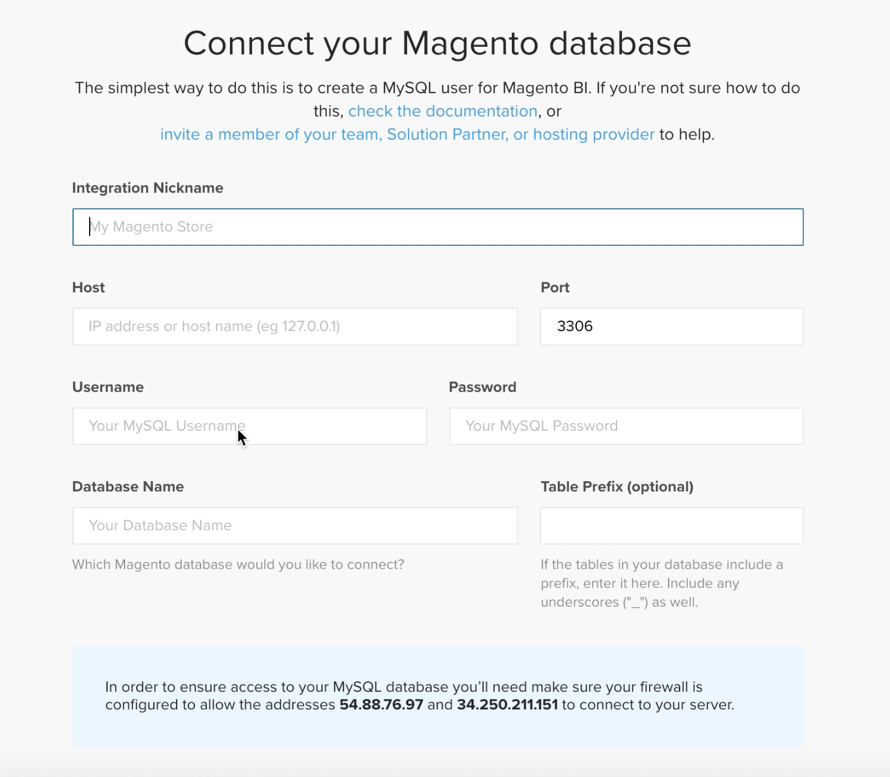

# Ativar o [!DNL MBI] Conta para `Cloud Starter` Assinaturas

Para ativar [!DNL MBI] para `Cloud Starter` projetos, primeiro crie um [!DNL MBI] , em seguida, crie uma `SSH` e, por fim, conecte-se ao banco de dados do Commerce. Consulte [ativação de assinaturas no local](../getting-started/onpremise-activation.md).

>[!NOTE]
>
>Para obter ajuda com a ativação [!DNL MBI] para `Cloud Pro` projetos, entre em contato com a equipe de conta da Adobe ou com o consultor técnico do cliente.

1. Crie seu [!DNL MBI] Conta.

   - Ir para [Logon na conta do Adobe Commerce](https://account.magento.com/customer/account/login)

   - Ir para **[!UICONTROL My Account** > **My [!DNL MBI] Instances]**.

   - Clique em **[!UICONTROL Create Instance]**. Se você não vir esse botão, entre em contato com a equipe de conta do Adobe ou com o consultor técnico do cliente.

   - Selecione o `Cloud Starter` assinatura. Se você tiver apenas um `cloud starter` assinatura, essa é a seleção padrão.

   - Clique em **[!UICONTROL Continue]**.

   - Insira suas informações para criar sua conta.

   

   - Vá para sua caixa de entrada e verifique seu endereço de email.

   

   - Crie sua senha.

   

   - Depois de criar sua conta, você pode adicionar usuários à nova conta. Agora é possível adicionar administradores técnicos para executar as etapas a seguir.

   

1. Insira informações sobre sua loja para definir suas preferências.

   

   Obtenha algumas informações antes de conectar seu banco de dados para a terceira etapa do fluxo de integração. Você conclui o `Connect your database` página na Etapa 9.

1. Criar dedicado [!DNL MBI] Usuário.

   - Crie um usuário no seu [Conta do Adobe Commerce](https://account.magento.com/customer/account/login).

   - _Por que um novo usuário?_ [!DNL MBI] precisa de um usuário adicionado ao projeto para buscar continuamente novos dados que serão transferidos para o [!DNL MBI] Data Warehouse. Esse usuário serve como essa conexão. A adição desse usuário ao projeto é abordada na Etapa 4.

   - O motivo para ter um serviço [!DNL MBI] usuário é impedir que o usuário adicionado seja inadvertidamente desativado ou excluído e parar o [!DNL MBI] conexão.

1. Adicione o usuário recém-criado ao ambiente primário do projeto como um `Contributor`.

   

1. Obtenha o seu [!DNL MBI] `SSH` chaves.

   - Vá para a `Connect your database` página do [!DNL MBI] configurar a interface do usuário e rolar para baixo até `Encryption settings`.

   - Para o `Encryption Type` escolha `SSH Tunnel`.

   - Na lista suspensa, é possível copiar e colar os dados fornecidos [!DNL MBI] `Public Key`.

   

1. Adicione seu novo [!DNL MBI] `Public key` para o [!DNL MBI] usuário criado na Etapa 5.

   - Ir para [sua conta do cloud Adobe Commerce](https://account.magento.com/cloud/customer/login/). Entre com as informações de logon da sua conta para a nova [!DNL MBI] usuário criado. Em seguida, acesse o `Account Settings` guia.

   - Role para baixo na página e expanda a lista suspensa para `SSH` chaves. Clique em **[!UICONTROL Add a public key]**.

   

   - Adicione o [!DNL MBI] `SSH Public Key` acima.

   

1. Fornecer [!DNL MBI] Credenciais do MySQL.

   - Atualize seu `.magento/services.yaml`

   ```sql
   mysql:
       type: mysql:10.0
       disk: 2048
       configuration:
           schemas:
               - main
           endpoints:
               mysql:
                   default_schema: main
                   privileges:
                       main: admin
               mbi:
                   default_schema: main
                   privileges:
                       main: ro
   ```

   - Atualize seu `.magento.app.yaml`

   ```sql
           relationships:
               database: "mysql:mysql"
               mbi: "mysql:mbi"
               redis: "redis:redis"
   ```

1. Obter informações para conectar seu banco de dados ao [!DNL MBI].

   Executar
   `echo $MAGENTO_CLOUD_RELATIONSHIPS | base64 --decode | json_pp`

   para obter informações sobre como conectar seu banco de dados.

   Você deve receber informações semelhantes à saída abaixo:

   ```json
           "mbi" : [
                 {
                    "scheme" : "mysql",
                    "rel" : "mbi",
                    "cluster" : "vfbfui4vmfez6-master-7rqtwti",
                    "query" : {
                       "is_master" : true
                    },
                    "ip" : "169.254.169.143",
                    "path" : "main",
                    "host" : "[!DNL MBI].internal",
                    "hostname" : "3m7xizydbomhnulyglx2ku4wpq.mysql.service._.magentosite.cloud",
                    "username" : "mbi",
                    "service" : "mysql",
                    "port" : 3306,
                    "password" : "[password]"
                 }
              ],
   ```

1. Conectar seu banco de dados do Commerce

   

   - `Integration Name`: [Escolha um nome para a integração.]

   - `Host`: `[!DNL MBI].internal`

   - `Port`: `3306`

   - `Username`: `mbi`

   - `Password`: [senha de entrada fornecida na saída para a Etapa 8.]

   - `Database Name`: `main`

   - `Table Prefixes`: [deixe em branco se não houver prefixos de tabela]

1. Defina as Configurações de fuso horário.

   

   - `Database`: `Timezone: UTC`

   - `Desired Timezone`: [Escolha o fuso horário no qual você deseja que seus dados sejam exibidos.]

1. Obter informações para suas configurações de criptografia.

   - A interface do usuário do projeto fornece uma `SSH` cadeia de caracteres de acesso. Essa string pode ser usada para coletar as informações necessárias para `Remote Address` e `Username` na configuração do seu `Encryption` configurações. Use o `SSH Access` encontrada clicando no botão Acessar site na ramificação principal da interface do usuário do projeto e localize o `User Name` e `Remote Address` conforme mostrado abaixo.

   

   

1. Informações de entrada para seu `Encryption` configurações

   

   **Entradas**

   - `Encryption Type`: `SSH Tunnel`

   - `Remote Address`: `ssh.us-3.magento.cloud`

   - `Username`: `vfbfui4vmfez6-master-7rqtwti--mymagento`

   - `Port`: `22`

1. Clique em **[!UICONTROL Save Integration]**.

1. Agora, você se conectou com êxito ao [!DNL MBI] conta.

1. Depois de se conectar com êxito [!DNL MBI] ao banco de dados do Commerce, entre em contato com a equipe da conta do Adobe para coordenar as próximas etapas, como a configuração de integrações e outras etapas de configuração.

1. Ao concluir a configuração, você poderá [fazer logon](../getting-started/sign-in.md) ao seu [!DNL MBI] conta.
