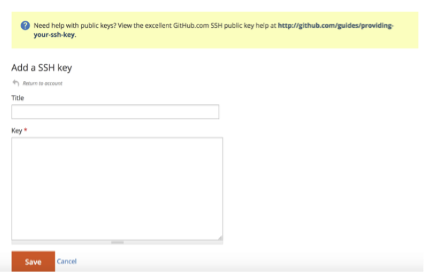
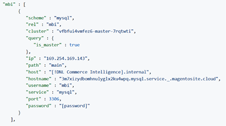
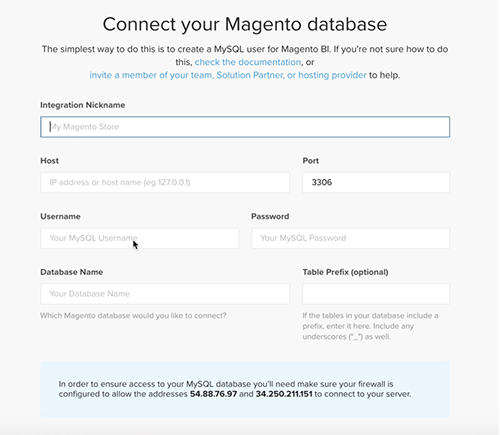

# Ativar a conta [!DNL Commerce Intelligence] para Assinaturas no Local e de Início

Para ativar o [!DNL Commerce Intelligence] para assinaturas locais, primeiro crie uma conta do [!DNL Commerce Intelligence], insira suas informações de configuração e conecte o [!DNL Commerce Intelligence] ao banco de dados do [!DNL Commerce]. <!-- For information about activation in `Cloud Starter` projects, see [Activating your [!DNL Commerce Intelligence] Account for `Cloud Starter` Subscriptions](../getting-started/cloud-activation.md).-->

## Crie sua conta do [!DNL Commerce Intelligence]

Para criar sua conta, entre em contato com a equipe de conta da Adobe ou com o consultor técnico do cliente.

## Crie sua senha

Depois que sua conta for criada, verifique se há um email de notificação de conta de [!DNL The Magento BI Team@rjmetrics.com]. Use o link fornecido no email para acessar sua conta do [!DNL Commerce Intelligence] e criar sua senha. Vá para sua caixa de entrada e verifique seu endereço de email.

Se você não recebeu um email, [contate o suporte](https://experienceleague.adobe.com/docs/commerce-knowledge-base/kb/troubleshooting/miscellaneous/mbi-service-policies.html?lang=en).

## Definir as preferências da loja

Antes de configurar a conexão de banco de dados, preencha o formulário de informações de armazenamento. Essas informações são necessárias para concluir a configuração do **[!UICONTROL Connect your Database]**.

## Adicionar [!DNL Commerce Intelligence] usuários

Depois de definir sua senha e fazer logon no [!DNL Commerce Intelligence], você pode adicionar outros usuários à sua conta do [!DNL Commerce Intelligence]. Ao adicionar usuários, adicione usuários administradores com as permissões apropriadas para concluir o processo de ativação.

## Criar um usuário [!DNL Commerce Intelligence] dedicado no administrador [!DNL Commerce]

Para usar o [!DNL Commerce Intelligence], você deve adicionar um usuário permanente e dedicado ao projeto [!DNL Commerce]. Este usuário dedicado serve como uma conexão permanente com o [!DNL Commerce] que permite a busca e a transferência de novos dados para o Data Warehouse [!DNL Commerce Intelligence] da conta.

A configuração de um usuário [!DNL Commerce Intelligence] dedicado garante que a conta não seja desativada ou excluída, interrompendo assim a conexão [!DNL Commerce Intelligence].

>[!NOTE]
>
>A Adobe incentiva o uso de um nome de conta que indique seu status permanente (por exemplo, ACI-dedicated, ACI-database-connector e assim por diante).

Depois de criar o usuário dedicado para [!DNL Commerce Intelligence] no Administrador, adicione o mesmo usuário ao ambiente primário do projeto [!DNL Commerce] com uma configuração **[!UICONTROL Master]** de `Contributor`.

## Obtenha suas chaves SSH do Commerce Intelligence

1. Na página [!UICONTROL Connect your database] da instalação do [!DNL Commerce Intelligence], role para baixo e selecione **[!UICONTROL Encryption settings]**.

1. Para **Tipo de Criptografia**, selecione `SSH Tunnel`.

1. No menu suspenso, copie a chave pública fornecida.

   

## Adicione sua chave pública ao [!DNL Commerce Intelligence]

1. No [!DNL Commerce Admin], entre usando as informações de logon do usuário [!DNL Commerce Intelligence] que você acabou de criar.

1. Selecione a guia **Configurações da conta**.

1. Role para baixo e expanda o menu suspenso **[!UICONTROL SSH Keys]**. Em seguida, selecione **[!UICONTROL Add a public key]**.

   

1. Cole a chave pública que você copiou na etapa [!DNL Encryption Type] acima.

   

## Fornecer credenciais do [!DNL Commerce Intelligence] do `MySQL` Essentials

1. Atualize seu `.magento/services.yaml`.

   

1. Atualize seu `.magento.app.yaml`.

   

## Obter informações de conexão do banco de dados

Obter as informações de conexão do banco de dados [!DNL Commerce] para [!DNL Commerce Intelligence]

1. Execute o seguinte para obter suas informações.

   `echo $MAGENTO_CLOUD_RELATIONSHIPS | base64 --decode | json_pp`

1. Revise as informações do banco de dados, que devem ser semelhantes ao exemplo a seguir.

   

## Conectar [!DNL Commerce Intelligence] ao banco de dados [!DNL Commerce] usando uma conexão criptografada

>[!NOTE]
>
>A Adobe recomenda que você use um túnel [`SSH tunnel`](../data-analyst/importing-data/integrations/mysql-via-ssh-tunnel.md) para fazer a conexão com o banco de dados. No entanto, se esse método não for uma opção, você ainda poderá vincular [!DNL Commerce Intelligence] ao banco de dados usando um [`direct connection`](../data-analyst/importing-data/integrations/mysql-via-a-direct-connection.md).

Insira suas informações de [!DNL Commerce Intelligence] na tela [!UICONTROL Connect your Magento Database].

**Entradas:**

[!UICONTROL Integration Name]: [escolha um nome para a instância [!DNL Commerce Intelligence]]

[!UICONTROL Host]: `mbi.internal`

[!UICONTROL Port]: `3306`

[!UICONTROL Nome de usuário]: `mbi`

[!UICONTROL Password]: [senha de entrada exibida na seção anterior]

[!UICONTROL Database Name]: `main`

[!UICONTROL Table Prefixes]: [deixe em branco se não houver prefixos de tabela]

## Definir suas configurações de [!UICONTROL **Fuso Horário**]

**Entradas:**

[!UICONTROL Database Timezone]: `UTC`

[!UICONTROL Desired Timezone]: [escolha o fuso horário para o qual deseja exibir seus dados]

## Obter informações de configurações de criptografia

A interface do projeto fornece uma cadeia de caracteres de acesso SSH. Esta cadeia de caracteres pode ser usada para coletar as informações necessárias para o [!UICONTROL **Endereço Remoto**] e o [!UICONTROL **Nome de Usuário**]. Use a cadeia de caracteres de Acesso SSH selecionando o botão de acesso do site na ramificação mestre da interface do usuário do projeto. Em seguida, localize seus [!UICONTROL User Name] e [!UICONTROL Remote Address] conforme mostrado abaixo.

## Insira suas configurações de [!DNL Encryption]

**Entradas:**

[!UICONTROL Encryption Type]: `SSH Tunnel`

[!UICONTROL Remote Address]: `ssh.us-3.magento.cloud` [da etapa anterior]

[!UICONTROL Username]: `vfbfui4vmfez6-master-7rqtwti—mymagento` [da etapa anterior]

[!UICONTROL Port]: `22`

## Salve sua integração.

Após concluir as etapas de configuração, aplique as alterações selecionando [!UICONTROL **Salvar Integração**].

Você conectou com êxito o banco de dados [!DNL Commerce] à conta [!DNL Commerce Intelligence].

>[!NOTE]
>
>Se você for um cliente do [!DNL Adobe Commerce Intelligence Pro], entre em contato com seu Gerente de sucesso do cliente ou com o Consultor técnico do cliente para coordenar as próximas etapas.

Após concluir a configuração, [entre](../getting-started/sign-in.md) em sua conta do [!DNL Commerce Intelligence].

<!---# Activate your [!DNL Commerce Intelligence] Account

To activate [!DNL Commerce Intelligence] for on-premise or `Cloud Pro` subscriptions, [contact support](https://experienceleague.adobe.com/docs/commerce-knowledge-base/kb/troubleshooting/miscellaneous/mbi-service-policies.html).

>[!NOTE]
>
>Adobe no longer supports new `Cloud Starter` subscriptions.--->
