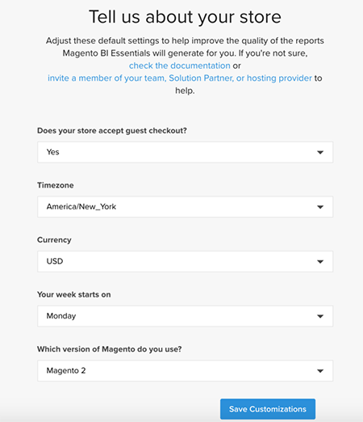
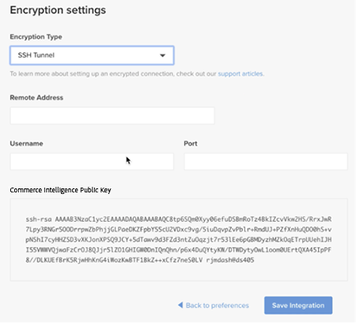
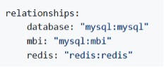
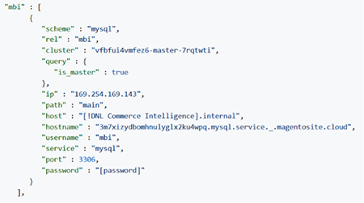
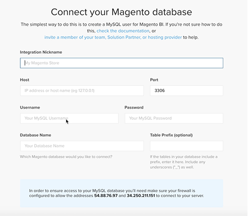
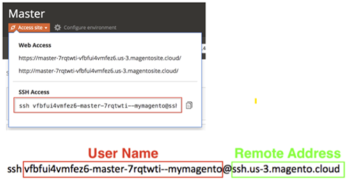

# Activate your [!DNL Commerce Intelligence] Account for On-Premise and Starter Subscriptions

To activate [!DNL Commerce Intelligence] for on-premise subscriptions, first create a [!DNL Commerce Intelligence] account, enter your settings information, then connect [!DNL Commerce Intelligence] to your [!DNL Commerce] database. <!-- For information about activation in `Cloud Starter` projects, see [Activating your [!DNL Commerce Intelligence] Account for `Cloud Starter` Subscriptions](../getting-started/cloud-activation.md).-->

## Criar sua conta do [!DNL Commerce Intelligence]

Para criar sua conta, entre em contato com sua Equipe de conta do Adobe ou com o Supervisor técnico do cliente.

## Criar sua senha

Depois que sua conta for criada, verifique se o email de notificação de conta de [!DNL The Magento BI Team@rjmetrics.com] foi enviado. Use o link fornecido no email para acessar sua conta do [!DNL Commerce Intelligence] e criar sua senha. Acesse sua caixa de entrada e verifique seu endereço de email.

Se você não recebeu um email, [contate o suporte](https://experienceleague.adobe.com/docs/commerce-knowledge-base/kb/troubleshooting/miscellaneous/mbi-service-policies.html?lang=pt-BR).

## Definir as preferências da loja

Antes de configurar a conexão de banco de dados, preencha o formulário de informações de armazenamento. Essas informações são necessárias para concluir a configuração do **[!UICONTROL Connect your Database]**.

## Add [!DNL Commerce Intelligence] users

After you set your password and log into [!DNL Commerce Intelligence], you can add other users to your [!DNL Commerce Intelligence] account. When adding users, add admin users with appropriate permissions to complete the activation process.

## Criar um usuário [!DNL Commerce Intelligence] dedicado no administrador [!DNL Commerce]

Para usar o [!DNL Commerce Intelligence], você deve adicionar um usuário permanente e dedicado ao projeto [!DNL Commerce]. Este usuário dedicado serve como uma conexão permanente com o [!DNL Commerce] que permite a busca e a transferência de novos dados para o Data Warehouse [!DNL Commerce Intelligence] da conta.

A configuração de um usuário dedicado [!DNL Commerce Intelligence] garante que a conta não seja desativada ou excluída, interrompendo assim a conexão [!DNL Commerce Intelligence].

>[!NOTE]
>
>O Adobe incentiva o uso de um nome de conta que indique seu status permanente (por exemplo, ACI-dedicado, ACI-database-connector, e assim por diante).

Depois de criar o usuário dedicado para [!DNL Commerce Intelligence] no Administrador, adicione o mesmo usuário ao ambiente primário do projeto [!DNL Commerce] com uma configuração **[!UICONTROL Master]** de `Contributor`.

## Get your Commerce Intelligence SSH keys

1. Na página [!UICONTROL Connect your database] da configuração [!DNL Commerce Intelligence], role para baixo e selecione **[!UICONTROL Encryption settings]**.

1. Para **Tipo de Criptografia**, selecione `SSH Tunnel`.

1. Na lista suspensa, copie a chave pública fornecida.

   

## Adicionar sua chave pública ao [!DNL Commerce Intelligence]

1. No [!DNL Commerce Admin], entre usando as informações de logon do usuário [!DNL Commerce Intelligence] recém-criado.

1. Selecione a guia **Configurações da conta**.

1. Role para baixo e expanda o menu suspenso **[!UICONTROL SSH Keys]**. Em seguida, selecione **[!UICONTROL Add a public key]**.

   

1. Cole a chave pública que você copiou na etapa [!DNL Encryption Type] acima.

   

## Provide [!DNL Commerce Intelligence] Essentials `MySQL` credentials

1. Atualize seu `.magento/services.yaml`.

   

1. Atualize seu `.magento.app.yaml`.

   

## Obter informações de conexão do banco de dados

Get the database connection information to the [!DNL Commerce] database to [!DNL Commerce Intelligence]

1. Run the following to get your information.

   `echo $MAGENTO_CLOUD_RELATIONSHIPS | base64 --decode | json_pp`

1. Review the database information, which should look similar to the following example.

   

## Connect [!DNL Commerce Intelligence] to your [!DNL Commerce] database using an encrypted connection

>[!NOTE]
>
>A Adobe recomenda que você use um túnel [`SSH tunnel`](../data-analyst/importing-data/integrations/mysql-via-ssh-tunnel.md) para fazer a conexão com o banco de dados. No entanto, se esse método não for uma opção, você ainda poderá vincular [!DNL Commerce Intelligence] ao banco de dados usando um [`direct connection`](../data-analyst/importing-data/integrations/mysql-via-a-direct-connection.md).

Insira suas informações de [!DNL Commerce Intelligence] na tela [!UICONTROL Connect your Magento Database].

**Entradas:**

[!UICONTROL Integration Name]: [escolha um nome para a instância [!DNL Commerce Intelligence]]

[!UICONTROL Host]: `mbi.internal`

[!UICONTROL Port]: `3306`

[!UICONTROL Username]: `mbi`

[!UICONTROL Password]: [input password displayed in the previous section]

[!UICONTROL Database Name]: `main`

[!UICONTROL Table Prefixes]: [leave blank if there are no table prefixes]

## Set your [!UICONTROL **Time Zone**] settings

**Entradas:**

[!UICONTROL Database Timezone]: `UTC`

[!UICONTROL Desired Timezone]: [escolha o fuso horário para o qual deseja exibir seus dados]

## Get your encryption settings information

The project UI provides an SSH access string. This string can be used for gathering the information needed for the [!UICONTROL **Remote Address**] and [!UICONTROL **Username**]. Use the SSH Access string by selecting the access site button on the Master branch of the Project UI. Then, find your [!UICONTROL User Name] and [!UICONTROL Remote Address] as shown below.

## Inserir suas configurações do [!DNL Encryption]

**Entradas:**

[!UICONTROL Encryption Type]: `SSH Tunnel`

[!UICONTROL Remote Address]: `ssh.us-3.magento.cloud` [da etapa anterior]

[!UICONTROL Username]: `vfbfui4vmfez6-master-7rqtwti—mymagento` [da etapa anterior]

[!UICONTROL Port]: `22`

## Salve sua integração.

Após concluir as etapas de configuração, aplique as alterações selecionando [!UICONTROL **Salvar Integração**].

Você conectou com êxito o banco de dados [!DNL Commerce] à conta [!DNL Commerce Intelligence].

>[!NOTE]
>
>Se você for um cliente do [!DNL Adobe Commerce Intelligence Pro], entre em contato com seu Gerente de sucesso do cliente ou com o Consultor técnico do cliente para coordenar as próximas etapas.

After you complete the configuration, [sign in](../getting-started/sign-in.md) to your [!DNL Commerce Intelligence] account.

<!--
# Activate your [!DNL Commerce Intelligence] Account

To activate [!DNL Commerce Intelligence] for on-premise or `Cloud Pro` subscriptions, [contact support](https://experienceleague.adobe.com/docs/commerce-knowledge-base/kb/troubleshooting/miscellaneous/mbi-service-policies.html?lang=pt-BR).

>[!NOTE]
>
>Adobe no longer supports new `Cloud Starter` subscriptions.
-->
