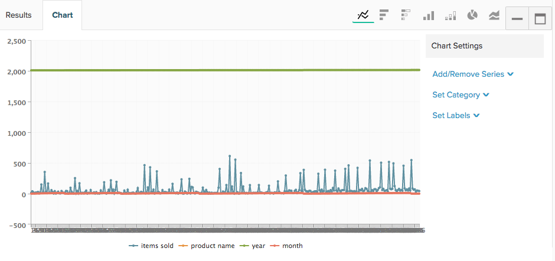

# Criar visualizações de consultas SQL

O objetivo deste tutorial é familiarizá-lo com a terminologia usada no `SQL Report Builder` e fornecer uma base sólida para criar `SQL visualizations`.

A variável [`SQL Report Builder`](../data-analyst/dev-reports/sql-rpt-bldr.md) é um construtor de relatórios com opções: você pode executar uma consulta com o único objetivo de recuperar uma tabela de dados ou pode transformar esses resultados em um relatório. Este tutorial explica como criar uma visualização de uma consulta SQL.

## Terminologia

Antes de começar este tutorial, consulte a seguinte terminologia usada no `SQL Report Builder`.

- `Series`: a coluna que você deseja medir é chamada de Série no Report Builder SQL. Exemplos comuns são `revenue`, `items sold`, e `marketing spend`. Pelo menos uma coluna deve ser definida como `Series` para criar uma visualização.

- `Category`: A coluna que você deseja usar para segmentar seus dados é chamada de `Category` Isso é exatamente como o `Group By` recurso no [`Visual Report Builder`](../data-user/reports/ess-rpt-build-visual.md). Por exemplo, se você quiser segmentar a receita vitalícia de seus clientes pela fonte de aquisição, a coluna que contém a fonte de aquisição seria especificada como a `Category`. Mais de uma coluna pode ser definida como `Category`.

>[!NOTE]
>
>Datas e carimbos de data e hora também podem ser usados como `Categories`. Eles são apenas outra coluna de dados na sua query e devem ser formatados e ordenados conforme desejado na própria query.

- `Labels`: eles são aplicados como rótulos de eixo x. Ao analisar a tendência dos dados ao longo do tempo, as colunas de ano e mês são especificadas como rótulos. Mais de uma coluna pode ser definida como Rótulo.

## Etapa 1: Gravar a consulta

Lembre-se do seguinte:

- A variável `SQL Report Builder` usos [`Redshift SQL`](https://docs.aws.amazon.com/redshift/latest/dg/c_redshift-and-postgres-sql.html).

- Se você estiver criando um relatório com uma série de tempo, certifique-se de `ORDER BY` a(s) coluna(s) de carimbo de data e hora. Isso garante que os carimbos de data e hora sejam plotados na ordem correta no relatório.

- A variável `EXTRACT` A função é ótima para usar na análise do dia, semana, mês ou ano do carimbo de data e hora. Isso é útil quando a variável `time interval` que você deseja usar no relatório é `daily`, `weekly`, `monthly`ou `yearly`.

Para começar, abra o `SQL Report Builder` clicando em **[!UICONTROL Report Builder** > **SQL Report Builder]**.

Como exemplo, considere esta consulta que retorna o número total mensal de itens vendidos para cada produto:

```sql
    SELECT SUM("qty") AS "Items Sold", "products's name" AS "product name",
    EXTRACT(year from "Order date") AS "year",
    EXTRACT(month from "Order date") AS "month"
    FROM "items"
    WHERE "products's name" LIKE '%Jeans'
    GROUP BY  "products's name", "year","month"
    ORDER BY "year" ASC,"month" ASC
    LIMIT 3500
```

Esta consulta retorna esta tabela de resultados:


## Etapa 2: criar a visualização

Com esses resultados, *como criar a visualização?* Para começar, clique no link **[!UICONTROL Chart]** na guia `Results` painel. Isso exibe o `Chart settings` guia.

Quando uma consulta é executada pela primeira vez, o relatório pode parecer inescrutável, pois todas as colunas na consulta são representadas como uma série:



Neste exemplo, você deseja que seja um gráfico de linhas com tendência ao longo do tempo. Para criá-lo, use estas configurações:

- `Series`: selecione a variável `Items sold` como a `Series` já que você deseja medi-la. Depois de definir um `Series` você verá uma única linha plotada no relatório.

- `Category`: neste exemplo, você deseja exibir cada produto como uma linha diferente no relatório. Para fazer isso, você define `Product name` como o `Category`.

- `Labels`: Use as colunas `year` e `month` como rótulos no eixo x para poder visualizar `Items Sold` como tendência ao longo do tempo.

>[!NOTE]
>
>A consulta deve conter um `ORDER BY` nos rótulos, se estiverem `date`/`time` colunas.

Veja abaixo rapidamente como você criou essa visualização, desde a execução da consulta até a configuração do relatório:


## Etapa 3: Selecionar um `Chart Type`

Este exemplo usa o `Line` tipo de gráfico. Para usar um `chart type`, clique nos ícones acima da seção de opções do gráfico para alterá-lo:


## Etapa 4: salvar a visualização

Se quiser usar este relatório novamente, dê um nome a ele e clique em **[!UICONTROL Save]** no canto superior direito.

Na lista suspensa, selecione `Chart` como o `Type` e, em seguida, um painel no qual salvar o relatório.

## Parabéns! Você terminou.

Quer ir um passo além? Confira o [práticas recomendadas de otimização de consulta](../best-practices/optimizing-your-sql-queries.md).
