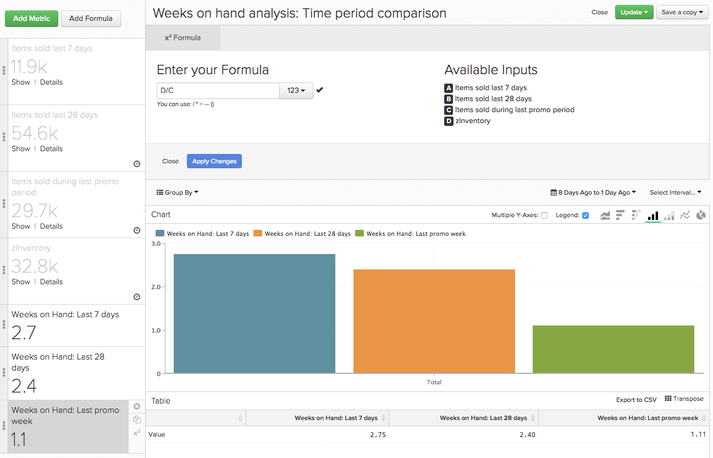

# Uso [!DNL Time] Opções no [!DNL Visual Report Builder]

Uma das características do [!DNL Visual Report Builder] é o global `Time Range` e `Interval` configurações. Essas configurações permitem analisar os dados no relatório por um período específico.

No entanto, para algumas análises, pode ser necessário considerar intervalos de tempo ou intervalos de tempo diferentes no mesmo relatório. É aí que `Time` As opções entram. Para ter uma ideia melhor de como usar o `Time` em seus relatórios, este tutorial aborda os seguintes casos de uso:

* [Análise de métricas sem carimbos de data e hora](#notimestamp)
* [Atribuição de um intervalo de tempo independente a uma métrica](#independenttimeinterval)
* [Comparação da mesma métrica em diferentes intervalos de tempo](#difftimerange)

Se quiser acompanhar alguns dos relatórios de amostra discutidos neste tópico, abra o [[!DNL Visual Report Builder]](../data-user/reports/ess-rpt-build-visual.md) antes de continuar.

## Análise de métricas sem carimbos de data e hora {#notimestamp}

Algumas métricas simplesmente não podem analisar a tendência ao longo do tempo porque os dados não são coletados ou armazenados com um carimbo de data e hora associado. Por exemplo, uma tabela de inventário geralmente contém apenas uma linha para cada SKU. Nesse caso, você deve [criar a métrica](../data-user/reports/ess-manage-data-metrics.md) sem especificar um carimbo de data e hora.

Ao usar essa métrica em seus relatórios, você percebe que adicionar essa métrica a um relatório define automaticamente uma métrica independente `Time Interval` de `None` e `Time Range` de `Global`:

## Atribuição de um intervalo de tempo independente a uma métrica {#independenttimeinterval}

`Time` As opções permitem criar gráficos 100% baseados em tempo para identificar qual dia, semana, mês ou ano contribuiu com mais valor durante um intervalo de tempo específico. Nesta seção, você cria um gráfico que mostra a porcentagem da receita gerada em cada mês do calendário de um ano.

Esse tipo de relatório pode ser útil se você quiser comparar a receita gerada ano a ano. Por exemplo, você tem um gráfico de 2015 que revela que janeiro contribuiu com 18% da receita do ano e um gráfico de 2016 mostrou apenas 8%. Você poderia começar a pesquisar o que poderia ter acontecido.

1. Adicione `Revenue` para o relatório.
1. Clique em **[!UICONTROL Duplicate]** para fazer uma cópia da métrica.
1. Clique no link global **[!UICONTROL Time Range]** , depois **[!UICONTROL Moving Time Range]**. Defina isso como `Last Year`.
1. Clique no link global **[!UICONTROL Time Interval]** e defina-a como `Monthly`.
1. O Report Builder adiciona automaticamente um segundo eixo Y para uma segunda métrica. Desmarque a opção `Multiple Y-Axes` caixa.
1. Em seguida, aplique uma `Time Interval` para a primeira métrica. Clique em **[!UICONTROL Time Options]** (ícone do relógio) à direita da `first Revenue metric`.
1. Clique em **[!UICONTROL Time Options]** na janela expandida exibida acima do relatório.
1. Na lista suspensa, defina o seguinte:

   * `Time Interval`: defina como `None`.

   * `Time Range`: defina como `Last Year` clicando primeiro em **[!UICONTROL Custom]**, depois **[!UICONTROL Moving Range]** e, por fim, selecionar a variável `Last Year` opção.

   * Clique em **[!UICONTROL Apply]** para salvar as configurações de intervalo e intervalo. Isso cria uma métrica que calcula a receita total do ano anterior. Em seguida, use essa métrica como denominador em uma fórmula.

   * Para visualizar o percentual da receita de cada mês, você deve adicionar uma fórmula ao relatório. Clique em **[!UICONTROL Add Formula]**.

   * Enter `B/A` no campo fórmula e selecione `% Percent` na lista suspensa ao lado do campo de texto. Essa fórmula divide a quantidade de receita de um mês específico do ano passado pela quantidade total de receita do ano passado.

   * Clique em **[!UICONTROL Apply Changes]**.

   * Oculte ambas as métricas de entrada e renomeie a fórmula.

Agora você pode ver o impacto que cada mês teve no ano passado:

## Comparação da mesma métrica em diferentes intervalos de tempo {#difftimerange}

Este exemplo usa uma dimensão personalizada chamada `Day number of the month`. Se quiser criar esse relatório e ainda não tiver essa dimensão em sua Data Warehouse, [entre em contato com o suporte](https://experienceleague.adobe.com/docs/commerce-knowledge-base/kb/troubleshooting/miscellaneous/mbi-service-policies.html) para obter assistência.

Os dois exemplos mais comuns nesta categoria são (1) comparar as métricas de crescimento (receita ano a ano ou mês a mês) e (2) entender melhor as tendências recentes de vendas de itens ou inventário.

Para demonstrar esse caso de uso, verifique a receita diária do mês anterior em comparação ao mesmo mês do ano anterior. Digamos que você queira analisar a receita de cada dia de janeiro de 2016 e depois compará-la com janeiro de 2015, janeiro de 2014 e assim por diante. Este relatório mostraria isso.

1. Adicione `Revenue` para o relatório.
1. Clique em **[!UICONTROL Duplicate]** para fazer uma cópia da métrica.
1. Renomear a primeira métrica para `Items sold last 7 days` e a segunda métrica, para `Items sold last 28 days`.
1. Clique em **[!UICONTROL Time Range]**, depois **[!UICONTROL Moving Time Range]**. Defina isso como `Last Month`.
1. Clique em **[!UICONTROL Time Interval]** e defina-o como `None`.
1. Clique em **[!UICONTROL Time Options]** (ícone de relógio) ao lado do segundo `Revenue` métrica.
1. Clique em **[!UICONTROL Time Options]** na janela expandida exibida acima do relatório.
1. Na lista suspensa, defina o seguinte:

   * `Time Interval`: defina como `None`.

   * `Time Range`: defina como `From 14 Months Ago To 13 Months Ago` clicando primeiro em **[!UICONTROL Custom]** depois **[!UICONTROL Moving Range]**. Use os campos e os menus suspensos na parte superior do menu para definir o intervalo. Essa configuração permite visualizar a receita do mês anterior, mas do ano anterior.

   Não se preocupe se a métrica desaparecer do relatório - definir uma opção de tempo independente oculta automaticamente a métrica do relatório. Para exibi-lo novamente, clique em **[!UICONTROL Show]** ao lado da métrica.

   

   * Clique em **[!UICONTROL Apply]** para salvar as configurações de intervalo e intervalo.

   * Em seguida, adicione o personalizado `Day number of the month` dimensão clicando em **[!UICONTROL Group By]** e selecionando a dimensão. Isso retornará o número do dia do mês de um pedido; por exemplo, um pedido feito em 2 de março retornará `2`.

   * No `Group By` selecione `Show All` e clique em **[!UICONTROL Apply]**. Isso cria os valores do eixo X para o relatório:

   

   * Renomeie as métricas. No exemplo, a primeira métrica é `Revenue - 2015` e o segundo é `Revenue - 2014`.

Outro uso comum do personalizado `Time Options` é determinar semanas de suprimento. Especialmente durante a temporada de festas ou um período promocional especial, você pode considerar os itens vendidos na última semana, mês e período promocional anterior para tomar decisões de compra informadas.

Lembre-se de definir os intervalos de tempo necessários ao criar esse relatório sozinho.

1. Adicione `Items Sold` para o relatório.
1. Clique em **[!UICONTROL Duplicate]** para fazer uma cópia da métrica.
1. Renomeie as métricas. Você pode usar os mesmos nomes ou algo semelhante:
   1. Renomear a primeira métrica para `Items sold last 7 days`.
   1. Renomeie a segunda métrica para `Items sold last 28 days`.
1. No `Items sold last 7 days` , clique na variável global **[!UICONTROL Time Range]** opção então **[!UICONTROL Moving Time Range]**. Neste exemplo, você o define como `Last 7 Days`.
1. Clique em **[!UICONTROL Time Interval]** e defina-o como `None`.
1. Em seguida, defina o `Time Options` para o `Items sold last 28 days` métrica. Clique em **[!UICONTROL Time Options]** (ícone do relógio) à direita da `second Items sold` métrica.
1. Clique em **[!UICONTROL Time Options]** na janela expandida exibida acima do relatório.
1. Na lista suspensa, defina o seguinte:

   * `Time Interval`: defina como `None`.
   * `Time Range`: defina como `From 29 days to 1 day ago` clicando primeiro em **[!UICONTROL Custom]**, depois **[!UICONTROL Moving Range]**. Use os campos e os menus suspensos na parte superior do menu para definir o intervalo.
   * Clique em **[!UICONTROL Apply]** para salvar as configurações de intervalo e intervalo.
   * Duplique o `Items sold last 28 days` e abra o campo da nova métrica `Time Options`. Defina as opções como a seguir:

      * `Time Interval`: deixe como `None`.
      * `Time Range`: altere para o intervalo de datas que se alinha à promoção em que você está interessado clicando em **[!UICONTROL Specific Date Range]** e, em seguida, insira as datas apropriadas.
      * Renomear a métrica `Items sold during last promotion` ou algo parecido.
      * Adicione `Units on hand` métrica.
      * Em seguida, adicione os cálculos que mostram as semanas disponíveis, considerando as tendências de vendas, para os períodos de tempo (`last 7 days`, `last 28 days`, e `last promo` período) que você está incluindo no relatório. Você deve fazer isso uma vez para cada período.

Para criar as fórmulas, clique em **[!UICONTROL Add Formula]**. Insira as fórmulas abaixo e clique em **[!UICONTROL Apply Changes]** quando terminar. Repita isso para cada um dos três períodos:

* Para o `last 7 days time period`, insira `D / A` no `Formula` campo.
* Para o `last 28 days time period`, insira `D / (B/4)` no `Formula` campo.

  >[!NOTE]
  >
  >É importante normalizar os intervalos de tempo selecionados aqui. Divida 28 dias em quatro semanas neste exemplo. Talvez seja necessário aplicar uma lógica diferente à fórmula.

* Para o `last promo period`, insira `D / C` no `Formula` campo.

  

* Por fim, personalize o relatório ocultando as métricas e adicionando uma `SKU` ou uma dimensão semelhante ao relatório como uma `Group By`.

Este exemplo demonstra que os níveis de estoque atuais estavam bem localizados para uma venda de 14 dias em todo o produto. No entanto, a adição de um período promocional comparável sugere que a empresa precisa fazer algumas alterações, seja solicitando mais estoque e promovendo apenas os itens com unidades suficientes em estoque.

Como seus clientes se comportam de forma diferente ao longo do tempo, você pode esperar ver variações nos dados ao executar análises. A definição de Opções de tempo personalizadas permite que você crie rapidamente análises complexas, permitindo decisões orientadas por dados que levam em consideração tendências históricas.

