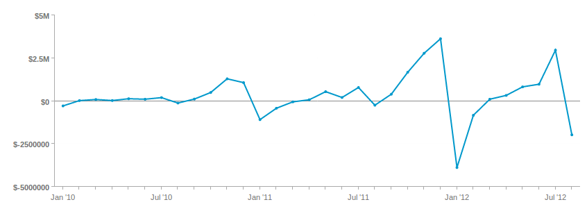

# Usar o [!DNL Visual Report Builder]

O [[!DNL Visual Report Builder]](../data-user/reports/ess-rpt-build-visual.md) permite que você explore visualmente seus dados para obter insights e ajudar a impulsionar as decisões comerciais. Este tutorial o guiará pelo processo de criação de um relatório básico.

>[!NOTE]
>
>Para adicionar um relatório a um painel, você precisa de `Standard` [permissões de usuário](../administrator/user-management/user-management.md) e acesso de `Edit` ao painel.

## Etapa 1: Criação de um relatório

Para começar a criar um relatório, clique em **[!UICONTROL Report Builder]** na barra lateral ou em **[!UICONTROL Add Report]** na parte superior de qualquer painel. Quando a página `Report Builder` for exibida, clique na opção **[!UICONTROL Visual Report Builder]**.

Para editar um relatório criado no [!DNL Visual Report Builder], clique no ícone de engrenagem (Opções) no canto superior direito de qualquer gráfico e clique em **[!UICONTROL Edit]**.

## Etapa 2: Adição de métricas

A primeira etapa na criação de uma análise é selecionar [a métrica](../data-user/reports/ess-manage-data-metrics.md) para analisar. Embora as métricas sejam listadas alfabeticamente por padrão, você também pode agrupá-las pela tabela que ativa a métrica.

Você pode adicionar outras métricas depois que a métrica inicial for selecionada e sobrepor todas as métricas em um único relatório ou executar cálculos de várias métricas adicionando fórmulas.

## Etapa 3: Adicionando `Formulas`

`Formulas` são adicionados aos relatórios ao clicar em **[!UICONTROL Add Formula]**, localizado logo acima da lista de métricas no relatório. No [editor de fórmulas](../data-analyst/dev-reports/formulas-in-rpt-bldr.md), qualquer métrica incluída no relatório pode ser usada como entrada. Operadores matemáticos básicos são usados para manipular as diferentes métricas.

Digamos que você deseje criar um relatório que mostre a receita média por pedido. Nesse caso, você dividiria a métrica `Revenue` pela métrica `Number of orders`.

## Etapa 4: Definindo o `Time Period` e `Interval of Analysis` {#time}

Para zerar em um período de tempo específico, é possível definir o período da análise. Você também pode escolher intervalos de tempo para segmentar os dados (por exemplo, por ano, por trimestre ou por mês). Use os menus no canto superior direito do gráfico para definir o período e o intervalo.

Ao definir um intervalo de datas específico para o período, verifique se a data de início está no início do intervalo e a data de término está no final do intervalo.

Por exemplo, definir um período de `January 1st` a `March 1st` e escolher um intervalo de `monthly` mostra `March` como ponto de dados, mas ignora todos os dias em `March` exceto `March 1`. Nesse caso, você deve criar seu `Time Period` a partir de `January 1 to March 31`.

## Etapa 5: `Group by` / `Segmenting the Analysis` {#groupby}

[Para segmentar suas métricas por uma dimensão de dados](../best-practices/segment-filter.md), clique no menu **[!UICONTROL Group by]** na parte superior esquerda do gráfico. Isso revela uma lista suspensa que inclui todas as dimensões disponíveis da primeira métrica incluída na lista.

Você pode escolher `None` para impedir que uma métrica seja segmentada. Por exemplo, você pode querer uma métrica que retorne a receita total sem ser segmentada, enquanto tem outra métrica de receita segmentada por região.

Retorne ao exemplo de receita média por pedido e defina o Group by para o código promocional. Isso mostra a receita média por pedido para pedidos com e sem um código promocional.

Se as métricas incluídas na análise forem criadas em tabelas de dados diferentes, uma janela pop-up permitirá selecionar a dimensão de dados correspondente em cada tabela. O objetivo aqui é encontrar dimensões que compartilham tipos de valores para segmentação:

## Etapa 6: configuração `Metric Filters`, `Perspective` e `Time Interval` {#metric-specific}

Para cada métrica adicionada à análise, é possível adicionar filtros, selecionar a perspectiva de dados relevante e definir opções de `time interval`. Para acessar esses recursos, clique nos ícones de funil (`Filter`), olho (`Perspective`) e relógio (`Time`) localizados ao lado das métricas incluídas no relatório.

### `Filters`

`Filters` limite o conjunto de dados incluído na análise. Os filtros são úteis, por exemplo, ao avaliar canais de aquisição individuais e remover outliers.

Além dos menus suspensos e da caixa de texto, você também pode usar operadores de filtro especiais, como `LIKE` ou `IN`, para criar filtros.

Há suporte para o uso de curingas (`%` ou `_`) com instruções `LIKE`. O curinga `%` corresponde a vários caracteres, enquanto `_` corresponde apenas a qualquer caractere único. Por exemplo:

- `affiliate's name Like B%` permite somente dados de clientes cujo nome comece com `B`.

- O `affiliate's name Like _ake` permite somente dados de clientes cujos nomes sejam algo como `Jake`, `Rake` ou `Bake`, mas não `Drake` ou `Blake`.

A adição de vários filtros permite um controle rígido dos dados do gráfico. Por padrão, todas as condições de filtro devem ser verdadeiras para que um pedaço de dados seja incluído, mas você pode criar relações OR editando a caixa de texto Regras de filtro.

### `Perspectives`

`Perspectives` Permitem alternar facilmente entre diferentes visualizações dos seus dados. Veja o que está disponível:

- `Standard perspective`: a perspectiva padrão mostra o resultado para a data correspondente no eixo x (por exemplo, receita em janeiro). Essa é a perspectiva que você usa no exemplo de Receita média por pedidos.

- `Amount` OR `Percent Change` versus `Previous Period` perspectiva: essa perspectiva mostra a quantidade ou porcentagem de alteração de um intervalo para o próximo e é útil para medir a taxa de alteração em métricas de alteração rápida. Também há uma perspectiva para comparar o intervalo com o mesmo período do ano passado para mostrar o crescimento ano a ano.

- `Cumulative perspective`: `cumulative perspective` mostra a quantidade de soma contínua ou cumulativa da métrica no período. Isso é usado com frequência para analisar o total de clientes e planejar a capacidade futura.

- `Percent of First Value perspective`: esta perspectiva mostra os dados como um percentual do primeiro intervalo incluído na análise. Isso é útil para medir a eficácia de ações específicas em relação ao desempenho do primeiro período.

- `Rolling averages window perspective`: a perspectiva da janela de médias contínuas mostra o valor da média contínua de uma métrica no intervalo de tempo especificado. O intervalo deve ser igual ao intervalo definido no nível de relatório. Por exemplo, se o relatório estiver mostrando o último trimestre completo de Receita por semana, você pode definir o intervalo de tempo da janela média acumulada para quatro semanas. Isso faz com que os três primeiros valores sejam nulos e o quarto valor represente a média das quatro primeiras semanas de Receita. Para maior clareza, desative a caixa de seleção `Multiple Y-Axes` se estiver visualizando a mesma métrica com uma média variável, como no exemplo abaixo.

### Opções de tempo específicas da métrica

Existem duas opções para as métricas usadas nos relatórios: elas podem analisar a tendência ao longo do tempo de acordo com as opções de tempo global, que as exibirão como um número escalar.

Alterar um intervalo de tempo de métrica para `None` retorna um número `scalar`, que é útil ao criar fórmulas que envolvem a divisão de uma métrica de tendência de tempo por um número `scalar`. Além disso, você também pode alterar o intervalo de tempo da métrica `scalar` para um intervalo de tempo independente daquele do relatório.

Por exemplo, você gostaria de ver a receita mensal de 2019 expressa como uma porcentagem da receita geral de 2019. Você pode adicionar duas métricas de `Revenue` a um relatório com um intervalo de tempo global de 1º de janeiro de 2019 a 31 de dezembro de 2019, segmentado por intervalo mensal.

>[!NOTE]
>
>Se você adicionar `group by` dimensões, escolha uma nova visualização ou ajuste o intervalo de tempo e salve apenas o Número (`scalar`). Esses ajustes não são mantidos na próxima vez que você abrir esse relatório em um painel; somente o intervalo de tempo será mantido.

Para saber mais sobre como usar as opções de tempo em seus relatórios, consulte este [tutorial](../tutorials/time-options-visual-rpt-bldr.md).

## Etapa 7: Salvar o relatório

Ao criar um gráfico, você pode salvá-lo clicando em **[!UICONTROL Save]** no canto superior direito de `Visual Report Builder`.

Você pode salvar um gráfico, tabela ou número (`scalar`) usando a lista suspensa `Type` e o painel no qual o relatório deve ser salvo usando a lista suspensa `Location`.

Você pode salvar o relatório clicando em **[!UICONTROL Save to Dashboard]**.

## Saídas do relatório

Para ajudá-lo a decidir qual saída de relatório escolher, consulte o seguinte:

### Gráfico

### Tabela

### Número (`scalar`)

Parabéns! Você terminou.
